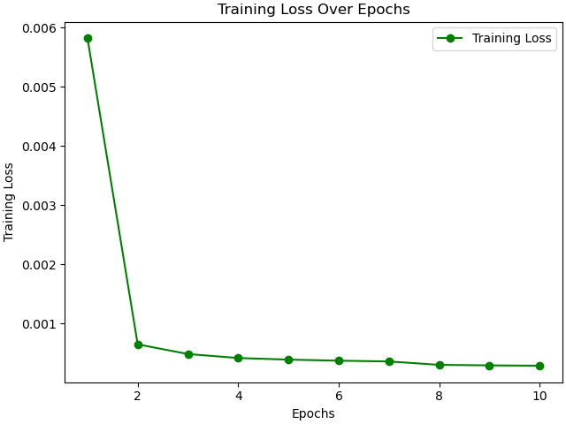

# Google Stock Price Prediction Using LSTM Tensorflow

## Overview

1. The Target of this Machine Learning project is to predict the next day's Google stock's Highest price using the LSTM model.
2. An LSTM-based neural network is designed with Keras in Tensorflow 2 to predict the next day's stock's Highest price.
3. RNN and LSTM are sequential learning models whereas LSTM is an upgraded model of RNN.
4. The prediction stock price graph is exactly following the actual price graph.

## Dataset

The dataset is available on [Yahoo Finance](https://finance.yahoo.com/quote/GOOG/history/)

## EDA

1. Load the dataset using Pandas.
2. Observe a few rows of the dataset carefully.
3. Check for a number of feature columns present in it.
4. Use info() to check datatypes of all feature columns it also shows various info about the dataset.
5. Check for, if null values present in the dataset. 
6. Use describe() to check various statistical information about data.

## Feature Engineering

1. Make the Date column as pandas DATETIME datatype.
2. Create day, month and year as 3 new features from the Date column.
3. For training data we will take data before 2019-01-01.
4. For testing data we will take data on and after 2019-01-01.
5. Delete the Date column as we no longer need it.
6. Do Feature normalization using MinMaxScaler()
7. x_train should contain the previous 60 samples with all features.  
8. y_train should contain the 61st sample of 'Open' value as we are predicting the stock's High price for the next day.

## LSTM Model

1. Create an LSTM neural network model.
2. Compile the model with optimizer='adam'and loss='MSE'
3. Fit the model with x_train, y_train, batch_size=100, epochs=30
4. Observe whether the loss is reducing with each epoch of training or not.
5. If the loss is not reducing then the model needs to be modified with new Hyperparameters.
6. If the loss is reducing then the model is working perfectly.
7. At the end of training the loss should be as minimal as possible.

## Validation Loss Plot

## Training Loss Plot

## LSTM Model Performance on Test Data

The **Regression Model** performance should be **evaluated** on **Mean Absolute Percentage Error.**

#### The Percentage Accuracy for Test data is 91.14 %

#### The Mean Absolute Percentage Error for Test data is 8.86 %

## Prediction Plot

## Conclusion 

#### The prediction graph exactly follows the actual graph bus accuracy improvement is still needed.

### Now, let's jump into the Jupyter Notebook and begin the Coding work.
